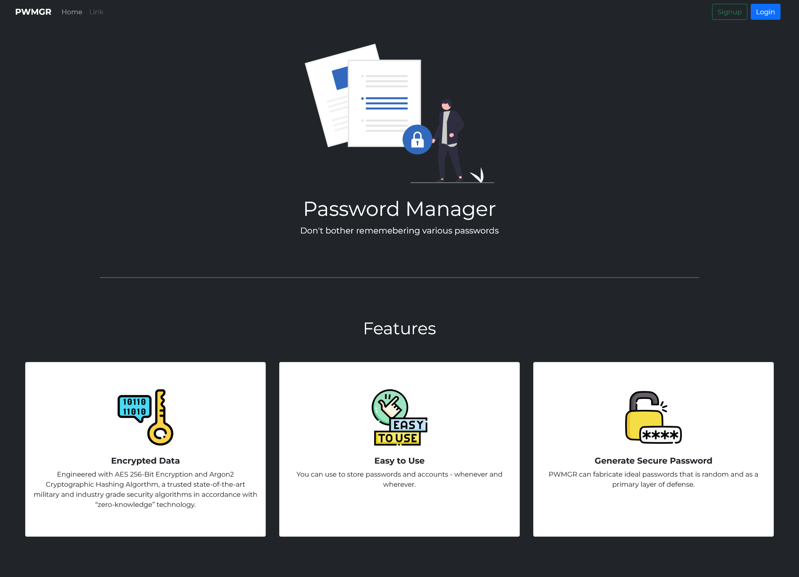

# PWMGR

**PWMGR** is a web password manager using the **MERN(MongoDB-Express-ReactJS-Node)** technology stack. It uses the Argon2 Hashing Algorithm and the AES-256 Encryption Algorithm.

## Landing Page



## Presentation

[](https://www.youtube.com/watch?v=E80Jhz9gMtU)

### Installation

  <details>
  <summary>Node JS Backend</summary>

1.  Change Directory:

    ```bash
    $ cd backend
    ```

2.  NPM Install:

    ```bash
    $ npm install
    ```

  </details>

  <details>
  <summary>React JS Frontend</summary>

1.  Change Directory:

    ```bash
    $ cd frontend
    ```

2.  NPM Install:

    ```bash
    $ npm install
    ```

3.  Start:

        ```bash
        $ npm run fullstack
        ```

    </details>
